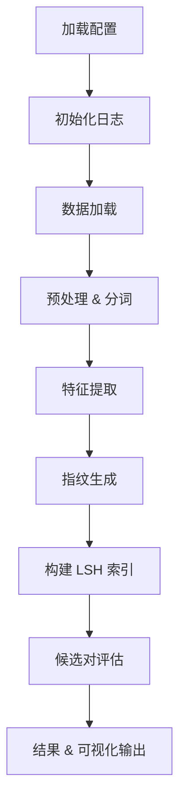

# HLSH: 基于局部敏感哈希的分层文本相似度检测系统

## 项目概述
HLSH 是一个基于 **局部敏感哈希**（*Locality‑Sensitive Hashing*, **LSH**）的系统，旨在高效检测近似重复文档。系统采用模块化流水线处理原始数据，提取特征、生成指纹并完成评估，可灵活配置与扩展。

---

## 系统特点
- **可配置工作流**：通过 `config/config.yaml` 轻松修改流水线行为
- **多种指纹算法**：内置 *MinHash*、*SimHash*、*BitSampling* 等方法
- **高效 LSH 索引**：快速构建索引以锁定候选文档对
- **完整评估体系**：支持精确度、召回率、F1 等指标
- **结果可视化**：自动生成运行时间对比与近似重复分布图
- **并行处理支持**：可调线程池 / 进程池提升吞吐

---

## 目录结构
```text
HLSH/
├── config/                 # 配置文件目录
│   └── config.yaml         # 主配置文件
├── data/                   # 数据目录
│   ├── raw/                # 原始输入数据
│   ├── processed/          # 处理过的数据和中间结果
│   └── results/            # 最终结果和报告
├── report/                 # 最终报告目录
│   └── final_report.pdf    # 最终报告文档
├── src/                    # 源代码目录
│   ├── fingerprint/        # 指纹生成模块
│   │   ├── minhash.py      # MinHash 实现
│   │   ├── simhash.py      # SimHash 实现
│   │   └── bitsampling.py  # BitSampling 实现
│   ├── lsh/                # LSH 相关模块
│   │   ├── lsh_index.py    # LSH 索引实现
│   │   └── evaluation.py   # 评估模块
│   ├── utils/              # 工具函数
│   │   ├── logger.py       # 日志功能
│   │   └── data_loader.py  # 数据加载工具
│   ├── feature_extraction.py  # 特征提取逻辑
│   ├── result_evaluation.py  # 挑选结果预览
│   ├── preprocessing.py    # 数据预处理逻辑
│   └── main.py             # 流水线入口点
├── exploration.ipynb       # 探索性分析 Jupyter 笔记本
├── requirements.txt        # Python 依赖
├── setup.py                # 安装脚本
└── README.md               # 项目文档
```

---

## 安装指南
```bash
# 1. 克隆仓库
git clone <仓库URL>
cd HLSH

# 2. 安装依赖
pip install -r requirements.txt
```

---

## 快速开始
1. 修改 `config/config.yaml` 以适配你的数据集与需求。
2. 运行主流水线：
   ```bash
   python src/main.py
   ```
3. 运行`python src/result_evaluation 10`随机挑选10个数据查看重复对效果
---

## 配置说明（`config/config.yaml`）
以下示例展示了常用可调选项：
```yaml
logging:
  log_file: "data/processed/system.log"
  log_level: "INFO"

data:
  # raw_data_path: "data/raw/test"           # 备用测试数据路径
  raw_data_path: "data/raw/sample_test.parquet"  # 原始数据文件路径

feature_extraction:
  method: "frequency"            # 可选: ngram (MinHash) | token, vectorize, frequency (SimHash)
  ngram_size: 3                   # n‑gram 的 n 值

fingerprint:
  method: "simhash"              # 可选: minhash | simhash | hybrid
  num_hashes: 100                # MinHash 的哈希函数数量 (仅 MinHash 使用)
  hash_bits: 64                  # SimHash 的签名位数
  seed: 42                       # 随机种子

lsh:
  method: "bitsampling"          # 可选: minhash | simhash | bitsampling | hybrid
  num_bands: 30                  # MinHash 的 band 数量
  rows_per_band: 5               # 每个 band 的行数
  radius: 5                      # SimHash 的 Hamming 距离半径
  num_hash_tables: 2             # BitSampling 的哈希表数量
  bits_per_table: 32             # 每个哈希表采样位数
  # 混合方法特有参数
  minhash_num_bands: 20          # 混合方法中 MinHash 的 band 数量
  minhash_rows_per_band: 5       # 混合方法中每个 band 的行数
  simhash_radius: 1              # 混合方法中 SimHash 的 Hamming 距离半径
  merge_strategy: "union"         # 合并策略: union | intersection | two-stage | weighted
  weights:                       # weighted 策略权重
    minhash: 0.6
    simhash: 0.4

parallel:
  enable: false                  # 总开关
  data_loader_parallel: false    # 数据加载并行
  preprocess_parallel: true      # 预处理并行
  feature_extraction_parallel: true  # 特征提取并行
  fingerprint_parallel: true     # 指纹生成并行
  thread_pool_size: 4            # 线程池大小 (I/O)
  process_pool_size: 8           # 进程池大小 (CPU)
  use_memory_cache: true         # 使用内存缓存

output:
  fingerpritnts_path: "data/processed/fingerprints.csv"      # 指纹输出
  evaluation_output_path: "data/processed"                   # 评估结果图保存路径
  results_path: "data/results/candidate_pairs_sampling.csv" # 候选对结果
  pipeline_output_path: "data/processed/pipeline_output.csv" # 流水线输出
  evaluation_html_path: data/results/sim_validation_evaluation.html # 评估结果HTML保存路径
```

---

## 工作流程


---

## 输出结果
| 产出 | 位置 |
| ---- | ----- |
| **候选文档对** | `data/results/candidate_pairs.csv` |
| **评估报告**   | 精确度 / 召回率 / F1 等指标 |
| **可视化图表** | 运行时间对比图、重复分布图 |
| **日志**       | `data/processed/system.log` |

---

## 故障排查
- 查看日志：`data/processed/system.log`
- 检查配置路径是否正确
- 验证输入数据格式

---

## 许可证
本项目基于 **MIT License**，详见 `LICENSE` 文件。

---

## 致谢
本项目源于离散数学实践课题，旨在探索高效的近似重复检测技术。感谢所有贡献者的支持与反馈！
