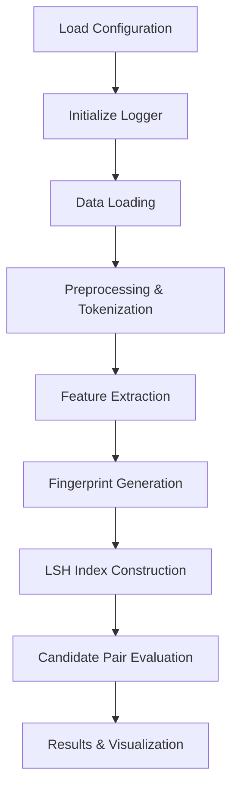

# HLSH: Hierarchical Locality-Sensitive Hashing (HLSH) Text Similarity Detection System

## Contributors

- Bowen Liu
- Junshan Tan
- Tianyu Guo
- Zebin Chen

## Project Overview

HLSH is a modular pipeline system based on **Locality-Sensitive Hashing (LSH)** designed for efficient detection of near-duplicate documents. The system processes raw data end-to-end by extracting features, generating fingerprints, indexing via LSH, and evaluating results. It is highly configurable and extensible.

---

## Key Features

- **Configurable Workflows**: Easily modify pipeline behavior via `config/config.yaml`
- **Multiple Fingerprinting Algorithms**: Built-in support for _MinHash_, _SimHash_, _BitSampling_, and more
- **Efficient LSH Indexing**: Rapid indexing to identify candidate document pairs
- **Comprehensive Evaluation**: Calculates precision, recall, F1-score, and other metrics
- **Result Visualization**: Automatically generates runtime comparison charts and duplicate-distribution plots
- **Parallel Processing Support**: Adjustable thread and process pools to boost throughput

---

## Directory Structure

```text
HLSH/
├── config/                 # Configuration files
│   └── config.yaml         # Main config file
├── data/                   # Data storage
│   ├── raw/                # Raw input data
│   ├── processed/          # Processed data and intermediates
│   └── results/            # Final results and reports
├── report/                 # Final report output
│   └── final_report.pdf    # Consolidated report
├── src/                    # Source code
│   ├── fingerprint/        # Fingerprint generation modules
│   │   ├── minhash.py      # MinHash implementation
│   │   ├── simhash.py      # SimHash implementation
│   │   └── bitsampling.py  # BitSampling implementation
│   ├── lsh/                # LSH-specific modules
│   │   ├── lsh_index.py    # LSH index implementation
│   │   └── evaluation.py   # Evaluation utilities
│   ├── utils/              # Utility functions
│   │   ├── logger.py       # Logging functionality
│   │   └── data_loader.py  # Data loading helpers
│   ├── feature_extraction.py  # Feature extraction logic
│   ├── result_evaluation.py  # Result sampling and preview
│   ├── preprocessing.py    # Data preprocessing logic
│   └── main.py             # Pipeline entry point
├── exploration.ipynb       # Exploratory analysis notebook
├── requirements.txt        # Python dependencies
├── setup.py                # Installation script
└── README.md               # Project documentation
```

---

## Installation Guide

```bash
# 1. Clone the repository
git clone <repo_url>
cd HLSH

# 2. Install dependencies
pip install -r requirements.txt
```

---

## Quick Start

1. Modify `config/config.yaml` to suit your dataset and requirements.
2. Run the main pipeline:
   ```bash
   python src/main.py
   ```
3. Preview 10 random candidate pairs:
   ```bash
   python src/result_evaluation.py 10
   ```

---

## Configuration (`config/config.yaml`)

Example of common adjustable options:

```yaml
logging:
  log_file: "data/processed/system.log"
  log_level: "INFO"

data:
  raw_data_path: "data/raw/sample_test.parquet"

feature_extraction:
  method: "frequency"    # options: ngram | token | vectorize | frequency
  ngram_size: 3          # n for n-grams

fingerprint:
  method: "simhash"     # options: minhash | simhash | hybrid
  num_hashes: 100        # number of hash functions (MinHash)
  hash_bits: 64          # bit-length of signature (SimHash)
  seed: 42               # random seed

lsh:
  method: "bitsampling"  # options: minhash | simhash | bitsampling | hybrid
  num_bands: 30           # bands (MinHash)
  rows_per_band: 5        # rows per band (MinHash)
  radius: 5               # hamming radius (SimHash)
  num_hash_tables: 2      # number of tables (BitSampling)
  bits_per_table: 32      # bits sampled per table (BitSampling)
  # hybrid-specific parameters
  minhash_num_bands: 20
  minhash_rows_per_band: 5
  simhash_radius: 1
  merge_strategy: "union"  # union | intersection | two-stage | weighted
  weights:
    minhash: 0.6
    simhash: 0.4

parallel:
  enable: false
  data_loader_parallel: false
  preprocess_parallel: true
  feature_extraction_parallel: true
  fingerprint_parallel: true
  thread_pool_size: 4
  process_pool_size: 8
  use_memory_cache: true

output:
  fingerprints_path: "data/processed/fingerprints.csv"
  evaluation_output_path: "data/processed"
  results_path: "data/results/candidate_pairs_sampling.csv"
  pipeline_output_path: "data/processed/pipeline_output.csv"
  evaluation_html_path: "data/results/sim_validation_evaluation.html"
```

---

## Workflow Diagram



---

## Output Artifacts

| Artifact                 | Location                                     |
| ------------------------ | -------------------------------------------- |
| **Candidate Pairs File** | `data/results/candidate_pairs.csv`           |
| **Evaluation Report**    | Precision / Recall / F1 metrics             |
| **Visualization Charts** | Runtime comparison & duplicate distribution |
| **Log File**            | `data/processed/system.log`                  |

---

## Troubleshooting

- Check logs at `data/processed/system.log`
- Verify all configuration paths are correct
- Confirm input data formats match expected schema

---

## License

This project is licensed under the **MIT License**. See the `LICENSE` file for details.
